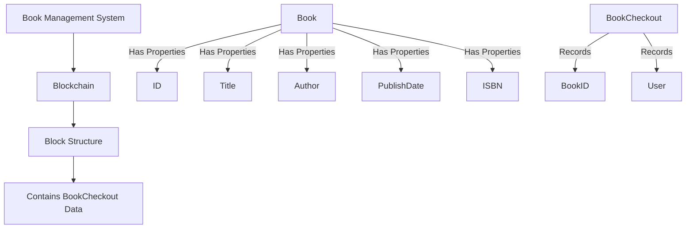
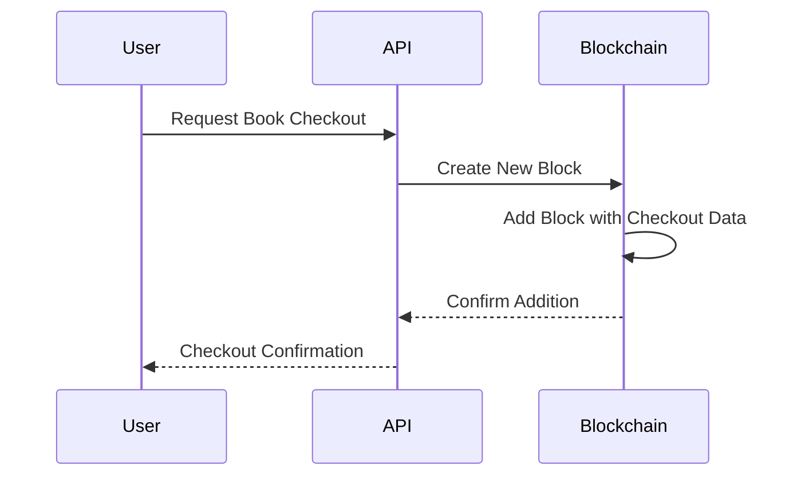

# Blockchain-Based Library Management System

A decentralized library management system built with Go, implementing blockchain technology to maintain an immutable record of book checkouts.

## Project Overview

This project demonstrates the implementation of blockchain concepts in a practical application using Go. The system tracks library book checkouts using a chain of blocks, where each block contains transaction data about book checkouts.

## System Architecture

### Core Components

### Transaction flow

## Technical Stack
- Language: Go 1.x
- Web Framework: Gorilla Mux
- API: RESTful endpoints
- Data Structure: Blockchain

## Features
- Blockchain-based transaction recording
- Book management (add, query)
- Checkout tracking
- Immutable transaction history
- RESTful API endpoints

## Getting Started
- Prerequisites
- Go 1.x
- Git

## Installation
### Clone the repository
git clone https://github.com/kedarvartak/Go-BLock

## Navigate to project directory
cd golang-blockchain

## Install dependencies
go mod download

## Run the application
go run main.go

## Contributing
- Fork the repository
- Create your feature branch (git checkout -b feature/AmazingFeature)
- Commit your changes (git commit -m 'Add some AmazingFeature')
- Push to the branch (git push origin feature/AmazingFeature)
- Open a Pull Request

## Learning Objectives
- Understanding blockchain fundamentals
- Go programming practices
- RESTful API development
- Distributed systems concepts
